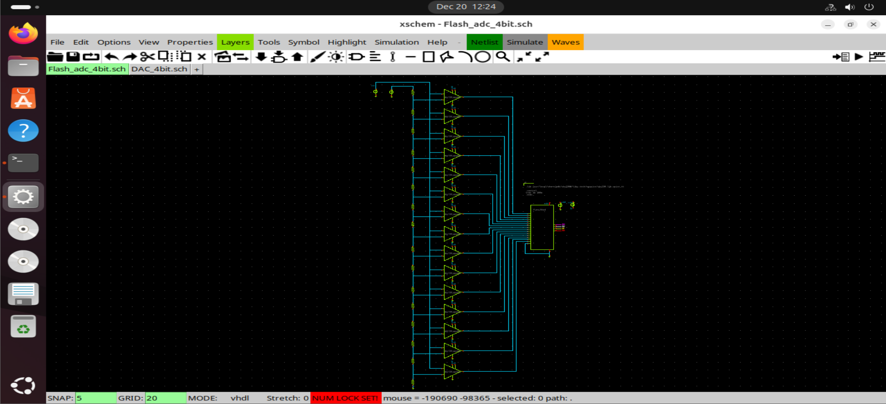
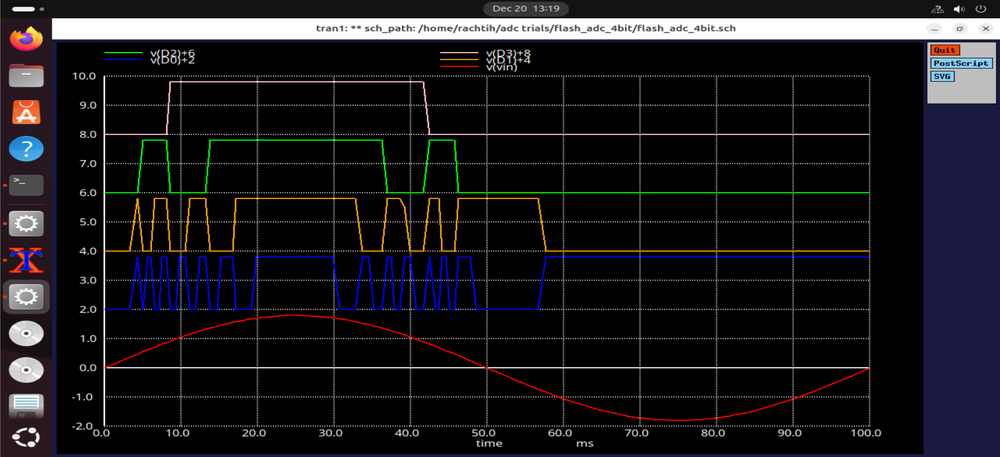
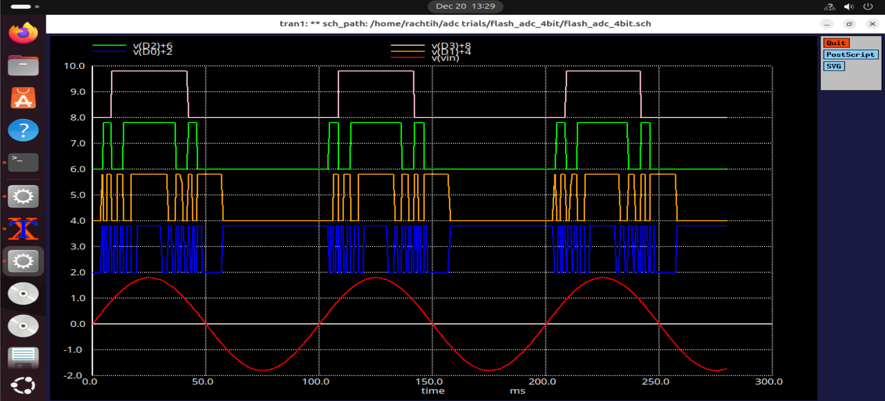
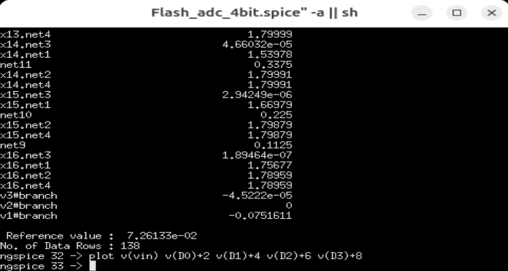

# 4-bit Flash ADC

This document describes the design and simulation of a **4-bit Flash Analog-to-Digital Converter (ADC)** implemented using the **Sky130 CMOS PDK** in Xschem.

The Flash ADC provides fast conversion from an analog input voltage to a 4-bit digital output. It leverages transistor-level **comparators**,
**resistor ladder reference network**, and **digital encoding logic**.

---

## Architecture Overview

The 4-bit Flash ADC consists of three main stages:

1. **Resistor Ladder Network**
   - Divides the reference voltage into 15 equal steps (for 4-bit resolution)
   - Provides reference voltages for comparators

2. **Comparator Array**
   - 15 comparators compare the input voltage with reference ladder nodes
   - Each comparator produces a 1-bit output indicating whether Vin exceeds the reference

3. **Digital Encoder**
   - Converts the thermometer code from comparators into a 4-bit binary code
   - Implemented using previously designed **16-to-4 priority encoders**

---

## Principle of Operation

1. The analog input voltage is applied to the comparators.
2. Each comparator produces a **thermometer code** (high for Vin > Vref, low otherwise).
3. The **priority encoder** converts this thermometer code into a meaningful **binary output** corresponding to the input voltage level.
4. Output is updated simultaneously for all comparators, providing fast conversion.

---

## Circuit Implementation

### Schematic

The schematic shows:
- 16 resistor network
- 15 transistor-level comparators
- 16-to-4 priority encoder

---

## Simulation Setup

The simulation applies:
- Sine input voltage to cover the entire output range
- Standard Sky130 voltage 1.8v

---

## Simulation Results

### Digital Output for Sine Wave Input
  

- A **sine wave** is applied as the input signal to the ADC.
- The ADC produces the correct **4-bit binary output** corresponding to the positive half-cycles of the input.
- During negative half-cycles, the output is one() 0001(as expected for ADC design).
- Each digital output represents a discrete increment or decrement in the applied analog signal.
- Confirms correct operation of comparator array and priority encoder.

---

### ngspice Simulation

- ngspice used to simulate full ADC
- Nodes monitored include input analog sine signal and final 4-bit digital result.

---

## Observations

- Correct thermometer-to-binary encoding achieved
- Comparator outputs accurately follow input voltage relative to reference ladder
- Priority encoder ensures correct MSB-priority binary output

---

## Applications

- High-speed low-resolution analog-to-digital conversion
- Mixed-signal interfaces requiring fast voltage digitization
- Educational and prototype ADC design studies

---

## Conclusion

The 4-bit Flash ADC successfully demonstrates fast, accurate analog-to-digital conversion using transistor-level comparators
and hierarchical digital encoding. The design showcases a **full mixed-signal implementation** using Sky130 components and highlights 
the practical integration of analog and digital primitives.
