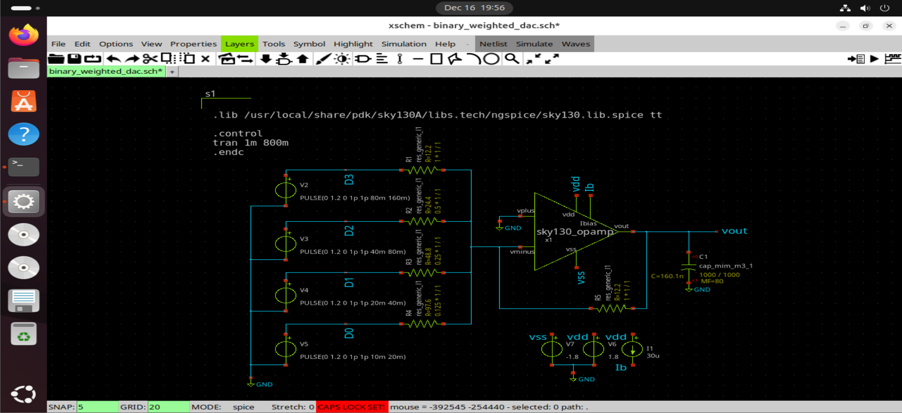
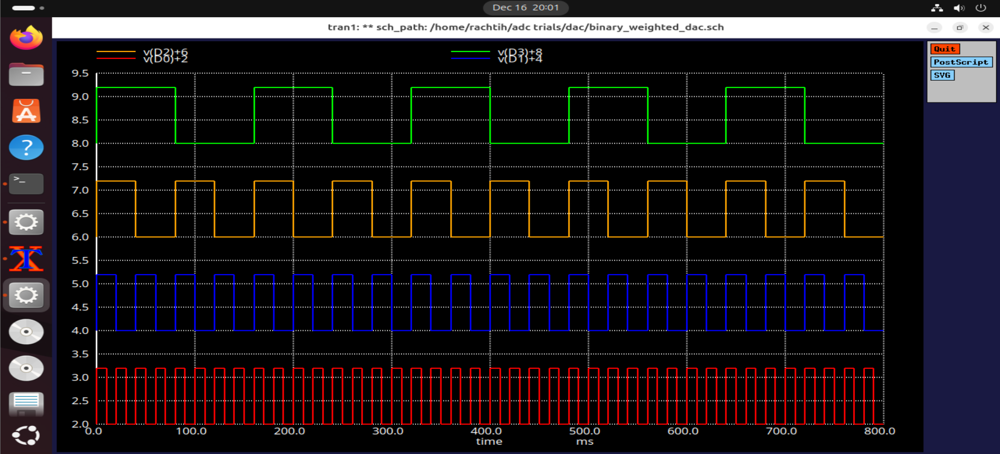
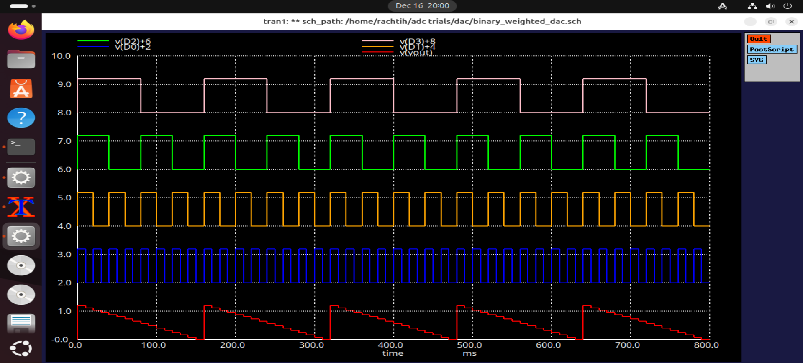
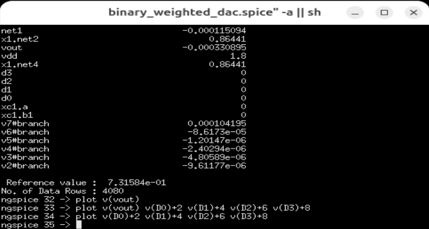

# 4-bit Binary Weighted DAC

This document describes the design and simulation of a **4-bit Binary Weighted
Digital-to-Analog Converter (DAC)** implemented using the **Sky130 PDK**
in Xschem.

The binary weighted DAC converts a digital input code into an analog voltage
by summing currents generated through resistors weighted according to the
binary significance of each input bit.

---

## Architecture Overview

The binary weighted DAC consists of:
- A set of resistors with values weighted as **R, 2R, 4R, and 8R**
- Digital input-controlled switches
- An op-amp used as a current summing and voltage conversion stage

Each resistor corresponds to a specific bit weight in the digital input word.

---

## Principle of Operation

Each digital input bit controls a switch that connects its corresponding
weighted resistor either to the reference voltage or to ground.

- The MSB contributes the largest current
- The LSB contributes the smallest current
- All currents are summed at the op-amp input node

The op-amp converts the summed current into an output voltage proportional
to the applied digital input code.

---

## Circuit Implementation

### Schematic

The schematic shows:
- Binary weighted resistor network
- Pulse sources for input digital count
- An op-amp configured as a summing amplifier

---

## Simulation Setup

### Inputs applied

The simulation applies:
- 4-bit digital count using pulse sources
- Standard Sky130 supply voltages 1.8v

This allows evaluation of DAC behavior across all input codes.

---

## Simulation Results

### Staircase Output Waveform
    

  

The transient simulation produces a staircase waveform where:
- Each step represents one LSB change in the digital input
- Output voltage increases with increasing input code
- Step heights vary according to resistor weighting accuracy

---

### ngspice Simulation

ngspice is used to simulate the circuit and plot digital inputs and analog
output voltage using explicitly defined plot commands.

---

## Observations

- Correct staircase waveform observed
- Output voltage follows binary weighting of inputs
- More sensitive to resistor mismatch compared to R-2R DAC
- MSB dominates output accuracy

---

## Limitations

- Requires a wide range of precise resistor values
- Matching becomes difficult as resolution increases
- Not easily scalable for higher bit widths

---

## Applications

Binary weighted DACs are suitable for:
- Low-resolution DAC implementations
- Educational and learning purposes
- Applications where resistor matching is well controlled

---

## Comparison with R-2R DAC

| Feature | Binary Weighted DAC | R-2R DAC |
|------|-------------------|---------|
| Resistor Values | R, 2R, 4R, 8R | Only R and 2R |
| Scalability | Limited | High |
| Matching Sensitivity | High | Lower |
| Impedance Consistency | Varies | Constant |

---

## Conclusion

The 4-bit binary weighted DAC successfully demonstrates digital-to-analog
conversion using weighted resistor summation. While simple and intuitive,
the architecture highlights the importance of resistor matching and motivates
the use of R-2R ladder DACs for scalable designs.
