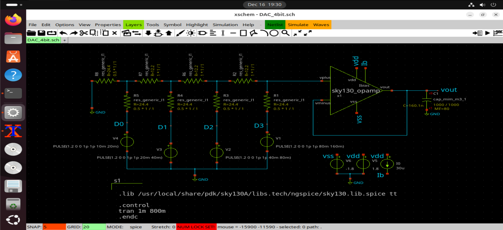
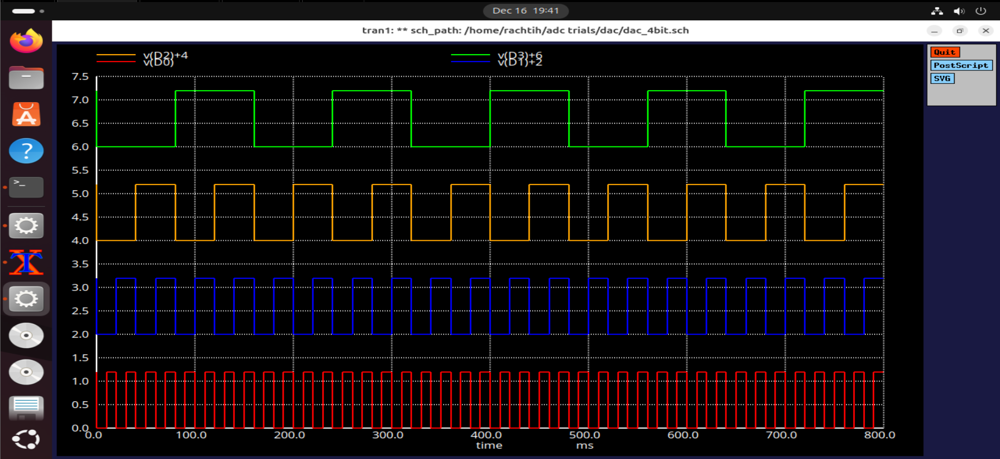
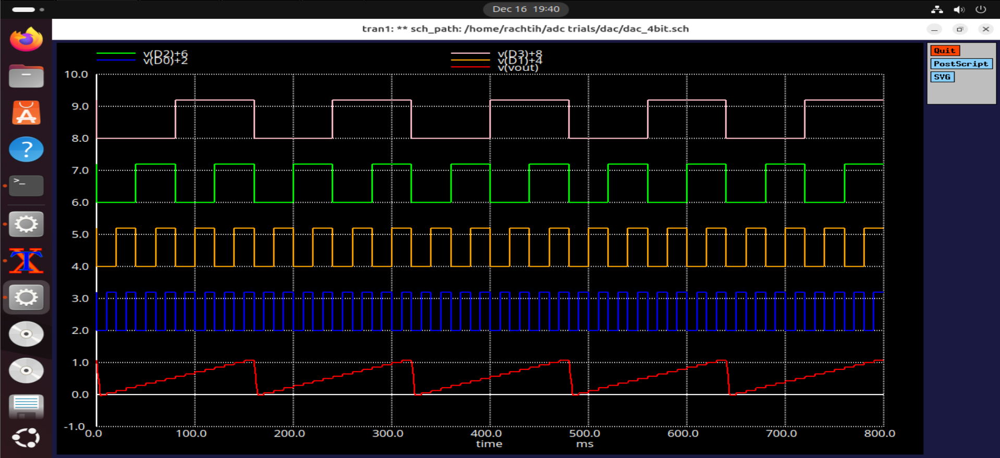

# 4-bit R-2R Ladder DAC

This document describes the design and simulation of a **4-bit R-2R ladder
Digital-to-Analog Converter (DAC)** implemented using the **Sky130 PDK**
in Xschem.

The R-2R DAC converts a 4-bit digital input code into a corresponding analog
output voltage using a resistor ladder network and an op-amp as the
output stage.

---

## Architecture Overview

The R-2R ladder DAC consists of:
- A ladder network composed of resistors with values **R** and **2R**
- Digital input-controlled switches
- An op-amp used as a current-to-voltage converter

This architecture ensures consistent impedance and improved matching
compared to binary weighted DACs.

---

## Principle of Operation

Each digital input bit controls a switch that connects its corresponding
ladder node either to the reference voltage or to ground.

The ladder network generates weighted currents that:
- Are summed at the op-amp input node
- Produce an analog output voltage proportional to the applied digital code

---

## Circuit Implementation

### Schematic

The schematic shows:
- R and 2R resistors arranged in a ladder configuration
- Digital control switches driven by the input code
- An op-amp used as the output amplifier

---

## Simulation Setup

### Inputs applied

The simulation applies:
- 4-bit digital counts using pulse sources
- Standard Sky130 supply voltages 1.8v

This setup enables observation of the DAC output across all input codes.

---

## Simulation Results

### Staircase Output Waveform
  

  

The transient simulation produces a **staircase waveform**, where:
- Each step corresponds to a single LSB increment
- The output voltage increases monotonically with input code
- The step height represents the DAC resolution

This staircase behavior confirms correct digital-to-analog conversion.

---

### ngspice Simulation

ngspice is used to simulate the DAC and plot both the digital inputs and
analog output. The simulation commands explicitly define the observed nodes
to ensure clarity and repeatability.

---

## Observations

- Uniform step size observed across the output range
- Good linearity and monotonic behavior
- Ladder structure maintains consistent impedance
- Stable output achieved using the CMOS op-amp

---

## Applications

The R-2R ladder DAC is suitable for:
- Low-to-medium resolution data converters
- Embedded mixed-signal interfaces
- Educational and prototyping applications

---

## Conclusion

The 4-bit R-2R ladder DAC successfully demonstrates accurate digital-to-analog
conversion using a compact and scalable architecture. The observed staircase
waveform validates correct operation and highlights the suitability of the
R-2R structure for integrated DAC implementations.
