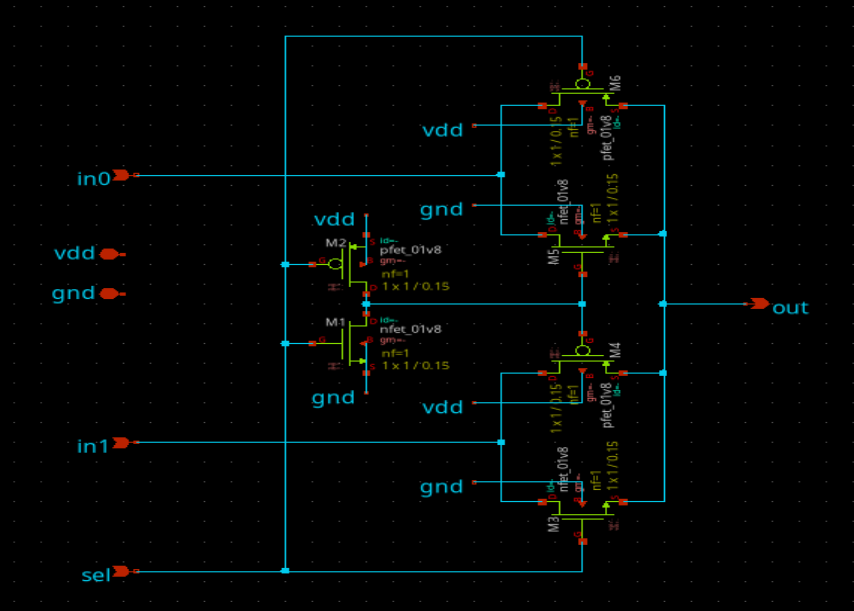
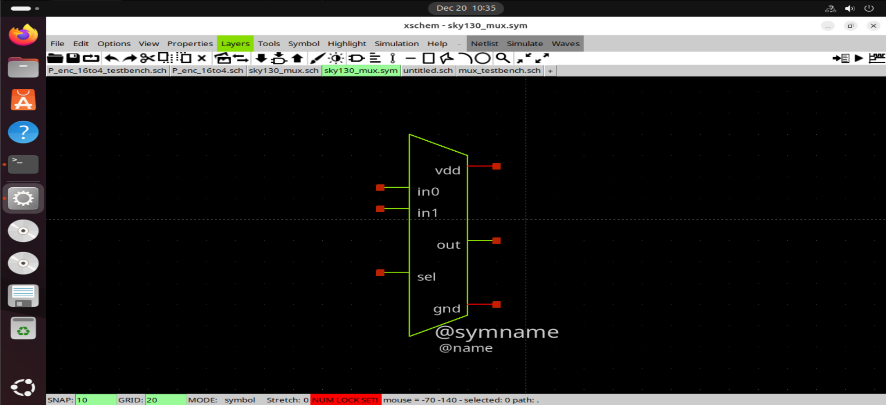
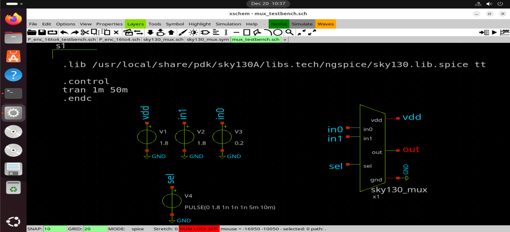
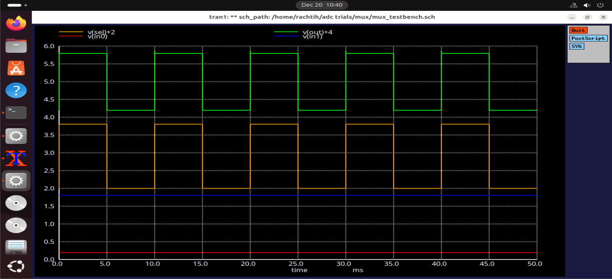
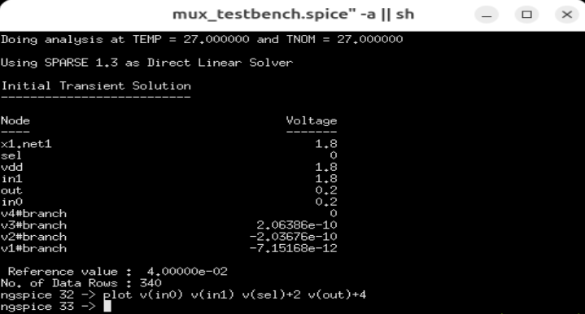

# 2:1 Multiplexer (Transistor-Level)

This document describes the design and simulation of a **2:1 multiplexer**
implemented at the **transistor level** using the **Sky130 PDK** in Xschem.
The multiplexer is designed as a reusable digital primitive and is later
instantiated in higher-level blocks.

---

## Functionality

A 2:1 multiplexer selects one of two input signals based on a single
selection input.

| Select (Sel) | Output (out) |
|------------|------------|
| 0          | in0        |
| 1          | in1        |

---

## Design Approach

The multiplexer is implemented using **CMOS transmission gate logic**.
Both the select signal and its complement are used to control the
transmission gates.

---

## Circuit Implementation

### Schematic
    

The circuit consists of:
- Two transmission gates connected to inputs in0 and in1
- Complementary control of NMOS and PMOS devices
- An inverter to generate the complement of the select signal

---

### Symbol

The symbol is created for hierarchical reuse in higher-level schematics,
allowing clean system-level design without exposing transistor-level details.

---

## Testbench Setup

### Testbench Schematic

The testbench applies:
- Different DC voltages to in0 and in1.
- A pulsating select signal (Sel)
- Standard Sky130 supply voltage (1.8v)

This setup allows simulation of correct input selection during
both static and dynamic operation.

---

## Simulation 

### Waveform Results

The waveforms confirm:
- Output follows input in0 when `Sel = 0`
- Output follows input in1 when `Sel = 1`
- No contention between inputs during switching

---

### ngspice Simulation

ngspice is used to simulate the circuit and plot the relevant node voltages.
The simulation commands explicitly specify the signals of interest,
ensuring reproducibility and clarity.

---

## Observations

- Transmission gate implementation prevents threshold voltage loss
- Clean switching behavior observed for select transitions

---

## Conclusion

The 2:1 CMOS multiplexer functions correctly across all input combinations
and serves as a robust, reusable digital primitive for larger
mixed-signal designs implemented using the Sky130 PDK.
