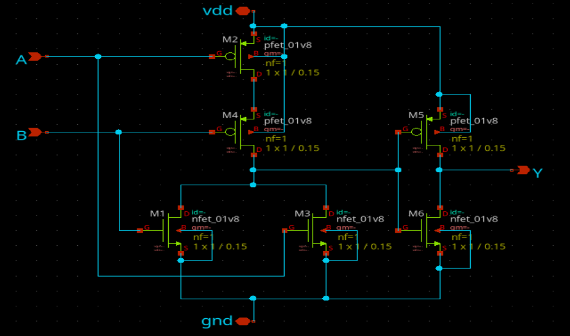
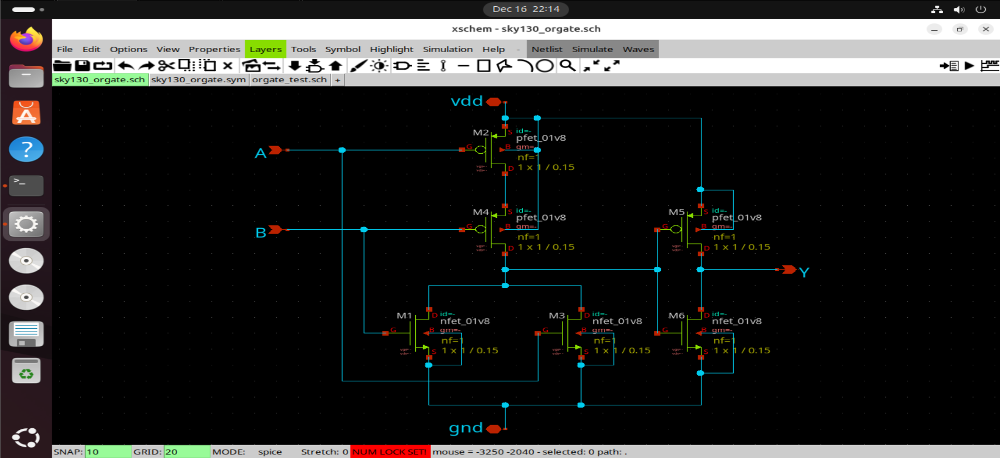
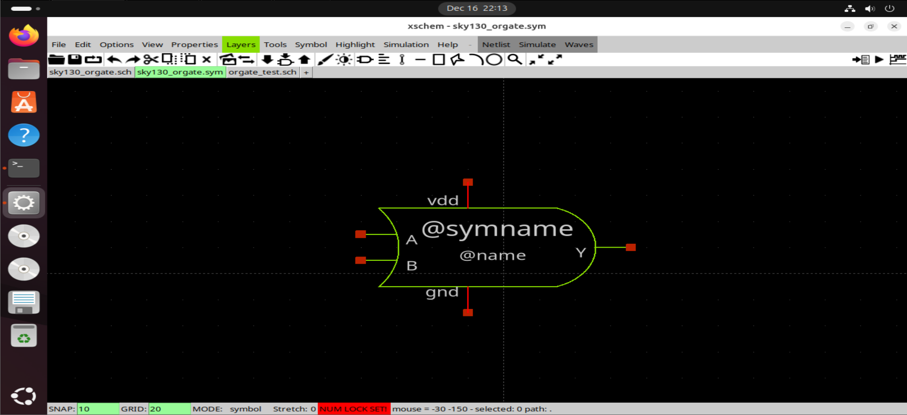
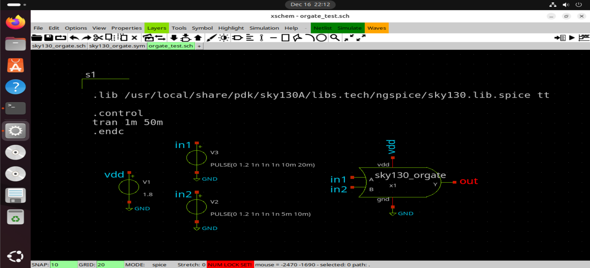
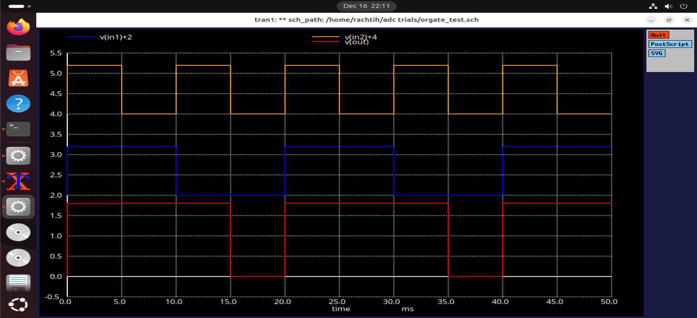
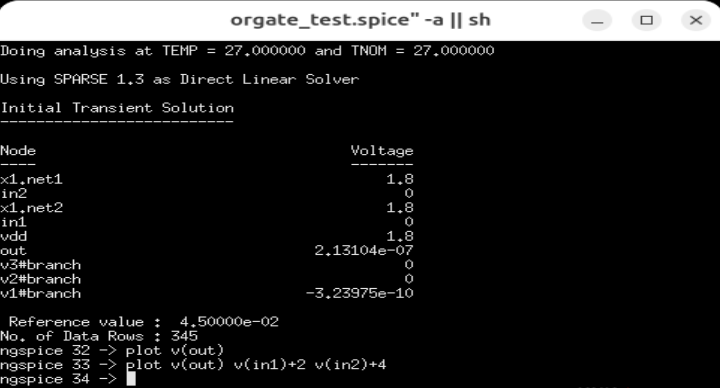

# CMOS OR Gate (Transistor-Level)

This document describes the design and simulation of a **2-input OR gate**
implemented at the **transistor level** using the **Sky130 PDK** in Xschem.
The OR gate is designed as a reusable digital primitive and is used as a
building block in higher-level digital and mixed-signal circuits such as
priority encoders and control logic.

---

## Functionality

A 2-input OR gate produces a logic high at the output if **any one or both**
of the inputs are high.

| Input A | Input B | Output Y |
|--------|--------|----------|
| 0      | 0      | 0        |
| 0      | 1      | 1        |
| 1      | 0      | 1        |
| 1      | 1      | 1        |

---

## Design Approach

The OR gate is implemented using **CMOS logic**.
The logic function is realized as a **NOR gate** followed by an Inverter.

---

## Circuit Implementation

### Schematic
  
  

The circuit consists of:
- A pull-up network (PMOS) arranged in **series**
- A pull-down network (NMOS) arranged in **parallel**
- An inverter stage to obtain the OR logic output

This structure ensures correct logic evaluation for all input combinations.

---

### Symbol

A custom symbol is created to allow hierarchical instantiation of the OR gate
in larger digital blocks without exposing transistor-level complexity.

---

## Testbench Setup

### Testbench Schematic

The testbench applies:
- Pulsed digital inputs to A and B
- Standard Sky130 supply voltage
- Observation of output transitions under all input conditions

---

## Simulation 

### Waveform Results

The simulation results confirm:
- Output remains low only when both inputs are low
- Output transitions high when either input is asserted
- Clean switching behavior with no undefined states

---

### ngspice Simulation

ngspice is used to simulate the OR gate and plot the input and output
node voltages. The simulation commands explicitly define the signals
to be observed, ensuring repeatable and transparent verification.

---

## Observations

- Correct logical operation across all input combinations

---

## Conclusion

The CMOS OR gate operates correctly under all tested conditions and serves
as a reliable, reusable digital primitive for larger transistor-level
designs implemented using the Sky130 PDK.
