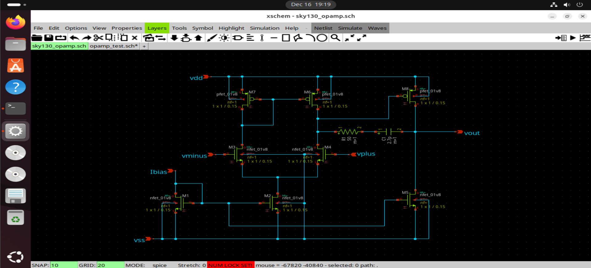
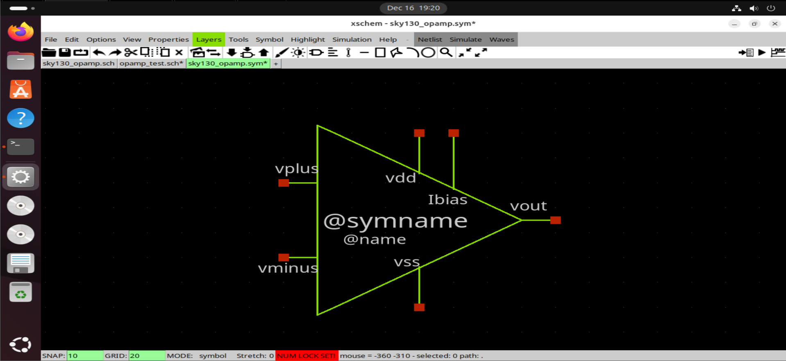
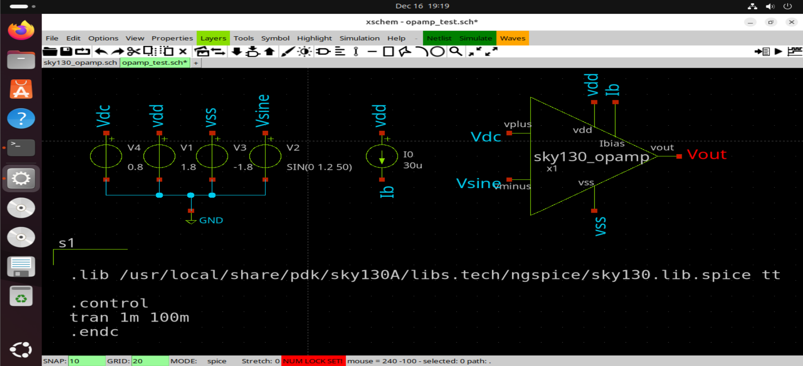
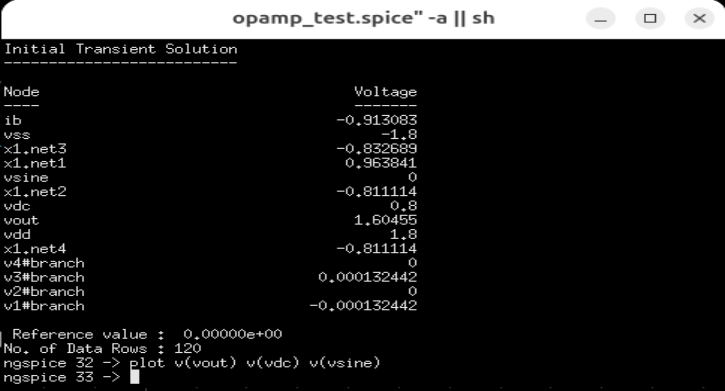

# Two-Stage Miller Op-Amp

This document describes the design and verification of a **two-stage Miller
operational amplifier**, implemented using the
**Sky130 PDK** in Xschem.

The op-amp is designed as a reusable analog primitive and is used in
data-converter blocks such as **DAC output stages** and **ADC reference and
comparison circuits**.

---

## Architecture Overview

The op-amp follows a **classical two-stage architecture**:

1. **First Stage (Input Differential Stage)**
   - NMOS differential input pair
   - PMOS active load
   - Provides high gain and differential-to-single-ended conversion

2. **Second Stage (Gain Stage)**
   - Common-source amplifier
   - Provides additional voltage gain and output swing
---

## Biasing Strategy

### Bias Current (Ibias)

The op-amp requires an **external bias current source (`Ibias`)** to:
- Establish the operating point of the differential input stage
- Ensure consistent biasing across process and temperature variations

The bias current is provided externally to allow:
- Flexible tuning of performance
- Reuse of the op-amp with different bias conditions in various applications

---

## Circuit Implementation

### Schematic
  

The schematic includes:
- Differential input transistors
- Second-stage gain transistor
- Miller compensation capacitor
- Bias current injection node

---

### Symbol

A custom symbol is created to enable hierarchical instantiation of the op-amp
in higher-level designs without exposing internal transistor details.

---

## Testbench Setup

### Testbench Schematic

The testbench is configured as inverting comparator to compare an input sine wave to a DC voltage.

---

## Simulation

Simulation results show:
- Stable behavior
- Absence of sustained oscillations
- Proper response to input

---

### ngspice Simulation

ngspice is used to simulate the op-amp and plot relevant node voltages and
frequency responses. Simulation commands explicitly define the measured
quantities for clarity and reproducibility.

---

## Observations

- Miller compensation successfully stabilizes the two-stage architecture
- The op-amp operates reliably within the intended supply range

---

## Conclusion

The two-stage Miller compensated CMOS op-amp achieves stable
operation using Sky130 devices. The use of an external bias current allows
flexible performance tuning, making the design suitable as a reusable analog
building block for mixed-signal systems.
