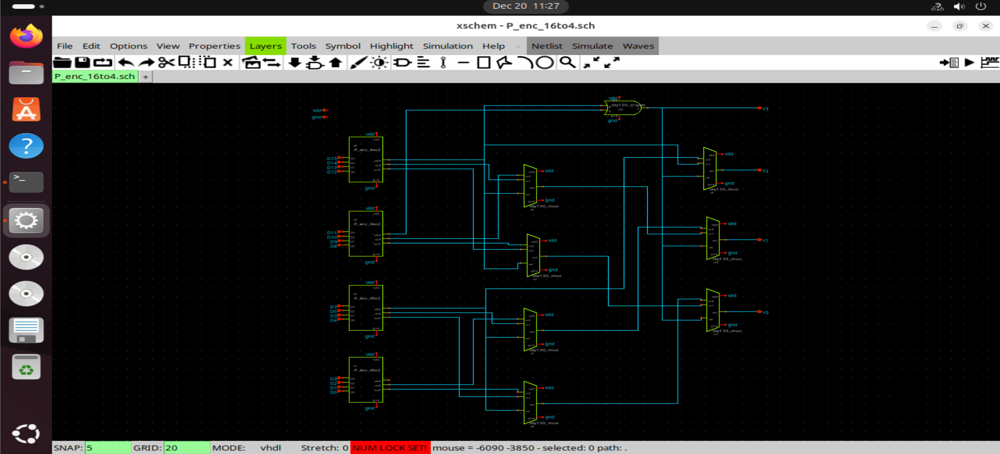
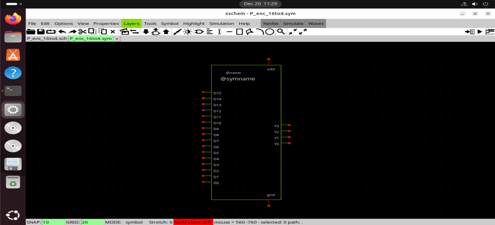
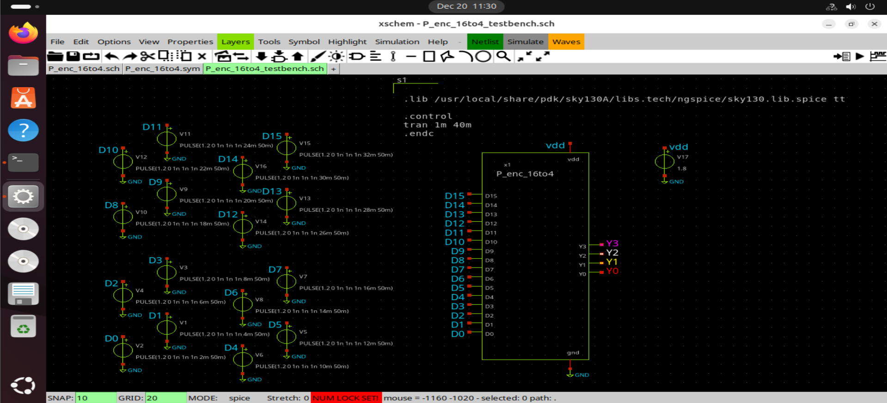
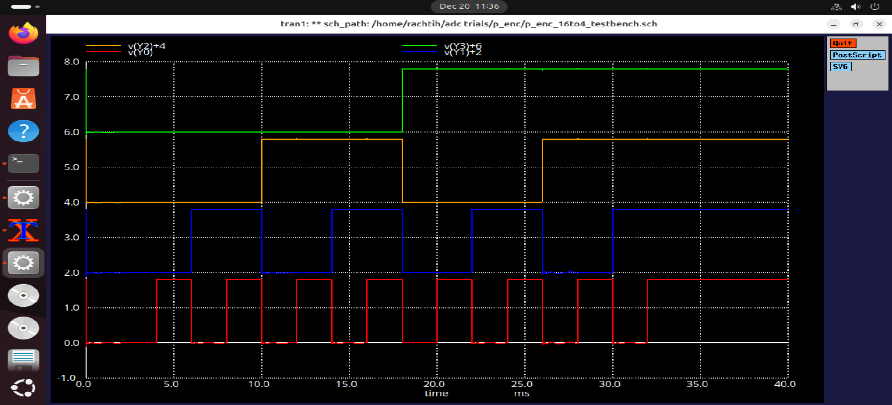
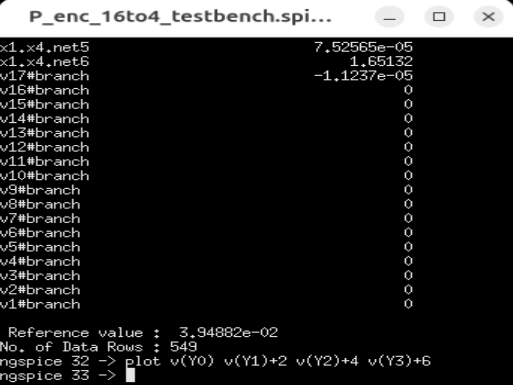

# 16-to-4 Priority Encoder (Hierarchical Design)

This document describes the design and simulation of a **16-to-4 priority encoder**
implemented using a **hierarchical approach** in Xschem.
Unlike the lower-level primitives, this encoder is **not implemented directly at
the transistor level**. Instead, it is constructed by cascading previously
designed and verified **4-to-2 priority encoders**, along with **multiplexers**
and **OR gate**.
This approach mirrors real-world digital IC design methodology, where complex
functions are built using validated reusable blocks.

---

## Functionality

A 16-to-4 priority encoder converts sixteen input signals into a 4-bit binary
output corresponding to the **highest-priority asserted input**.

Priority order (highest to lowest): D15 > D14 > ... > D1 > D0

## 16-to-4 Priority Encoder Truth Table (MSB Priority)

| D15 | D14 | D13 | D12 | D11 | D10 | D9 | D8 | D7 | D6 | D5 | D4 | D3 | D2 | D1 | D0 | Y3 | Y2 | Y1 | Y0 |
|-----|-----|-----|-----|-----|-----|----|----|----|----|----|----|----|----|----|----|----|----|----|----|
| 1   | X   | X   | X   | X   | X   | X  | X  | X  | X  | X  | X  | X  | X  | X  | X  | 1  | 1  | 1  | 1  |
| 0   | 1   | X   | X   | X   | X   | X  | X  | X  | X  | X  | X  | X  | X  | X  | X  | 1  | 1  | 1  | 0  |
| 0   | 0   | 1   | X   | X   | X   | X  | X  | X  | X  | X  | X  | X  | X  | X  | X  | 1  | 1  | 0  | 1  |
| 0   | 0   | 0   | 1   | X   | X   | X  | X  | X  | X  | X  | X  | X  | X  | X  | X  | 1  | 1  | 0  | 0  |
| 0   | 0   | 0   | 0   | 1   | X   | X  | X  | X  | X  | X  | X  | X  | X  | X  | X  | 1  | 0  | 1  | 1  |
| 0   | 0   | 0   | 0   | 0   | 1   | X  | X  | X  | X  | X  | X  | X  | X  | X  | X  | 1  | 0  | 1  | 0  |
| 0   | 0   | 0   | 0   | 0   | 0   | 1  | X  | X  | X  | X  | X  | X  | X  | X  | X  | 1  | 0  | 0  | 1  |
| 0   | 0   | 0   | 0   | 0   | 0   | 0  | 1  | X  | X  | X  | X  | X  | X  | X  | X  | 1  | 0  | 0  | 0  |
| 0   | 0   | 0   | 0   | 0   | 0   | 0  | 0  | 1  | X  | X  | X  | X  | X  | X  | X  | 0  | 1  | 1  | 1  |
| 0   | 0   | 0   | 0   | 0   | 0   | 0  | 0  | 0  | 1  | X  | X  | X  | X  | X  | X  | 0  | 1  | 1  | 0  |
| 0   | 0   | 0   | 0   | 0   | 0   | 0  | 0  | 0  | 0  | 1  | X  | X  | X  | X  | X  | 0  | 1  | 0  | 1  |
| 0   | 0   | 0   | 0   | 0   | 0   | 0  | 0  | 0  | 0  | 0  | 1  | X  | X  | X  | X  | 0  | 1  | 0  | 0  |
| 0   | 0   | 0   | 0   | 0   | 0   | 0  | 0  | 0  | 0  | 0  | 0  | 1  | X  | X  | X  | 0  | 0  | 1  | 1  |
| 0   | 0   | 0   | 0   | 0   | 0   | 0  | 0  | 0  | 0  | 0  | 0  | 0  | 1  | X  | X  | 0  | 0  | 1  | 0  |
| 0   | 0   | 0   | 0   | 0   | 0   | 0  | 0  | 0  | 0  | 0  | 0  | 0  | 0  | 1  | X  | 0  | 0  | 0  | 1  |
| 0   | 0   | 0   | 0   | 0   | 0   | 0  | 0  | 0  | 0  | 0  | 0  | 0  | 0  | 0  | 1  | 0  | 0  | 0  | 0  |  

When multiple inputs are asserted simultaneously, the output reflects only
the highest-priority input.

---

## Design Approach

The encoder is designed using **hierarchical composition**, leveraging:
- Four 4-to-2 priority encoder blocks
- Multiplexers for output selection
- OR gate for priority propagation and control
- Readability and scalability
- Reusability across larger systems

---

## Block-Level Structure

The 16 inputs are divided into four groups:
- Group 0: D3–D0
- Group 1: D7–D4
- Group 2: D11–D8
- Group 3: D15–D12

Each group is processed by a **4-to-2 priority encoder**, generating:
- Local encoded outputs
- Group-valid signals

The valid signals are used by MUX control to
select the encoded output corresponding to the highest-priority group.

---

## Circuit Implementation

### Schematic

The schematic shows:
- Cascaded 4-to-2 priority encoder instances
- Multiplexers used for hierarchical output selection
- OR gate for group priority detection

---

### Symbol

A custom symbol is created to allow clean instantiation of the encoder
in the Flash ADC top-level schematic.

---

## Testbench Setup

### Testbench Schematic

The testbench applies:
- Single and multiple asserted inputs
- Overlapping inputs across different priority groups
- Standard Sky130 supply voltage 1.8v

---

## Simulation

### Waveform Results

Simulation results confirm:
- Correct 4-bit output encoding
- Proper propagation of priority across groups
- Correct group selection using MUX logic

---

### ngspice Simulation

ngspice is used to simulate the hierarchical encoder and observe both
intermediate and final output signals, ensuring correctness at each
stage of the cascade.

---

## Observations

- Hierarchical priority resolution functions as intended
- Lower-priority groups are correctly masked
- Modular structure simplifies validation and reuse

---

## Conclusion

The 16-to-4 priority encoder successfully demonstrates hierarchical digital
design using reusable primitives. By cascading verified 4-to-2 encoders
along with MUX and OR logic, a scalable and maintainable solution is achieved
for higher-order priority encoding in mixed-signal systems.

