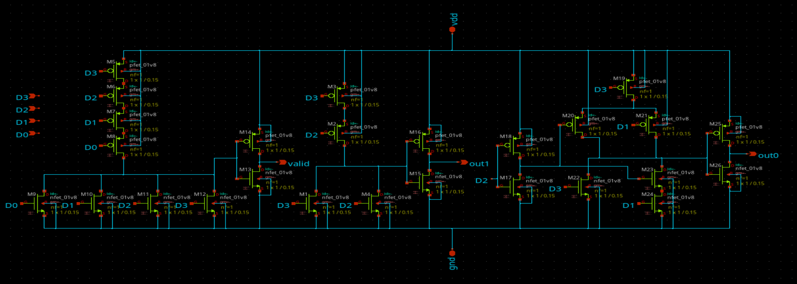
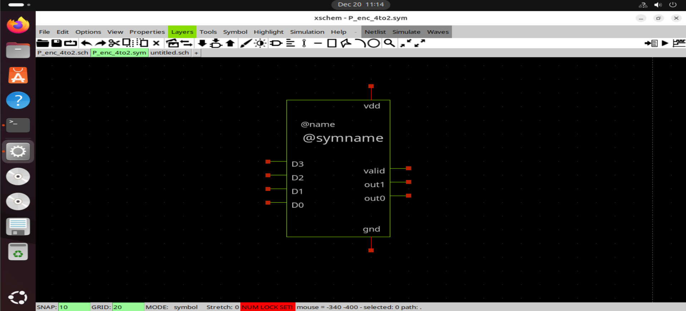
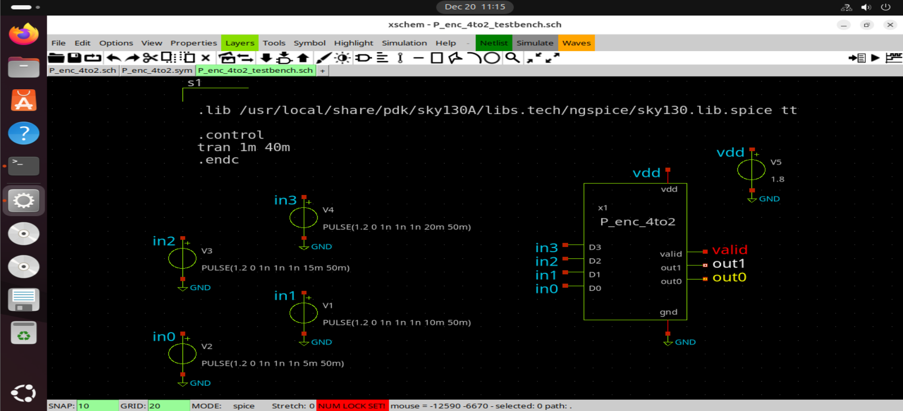
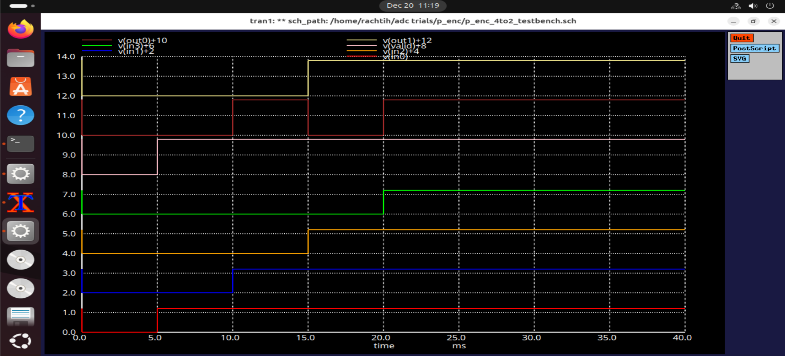
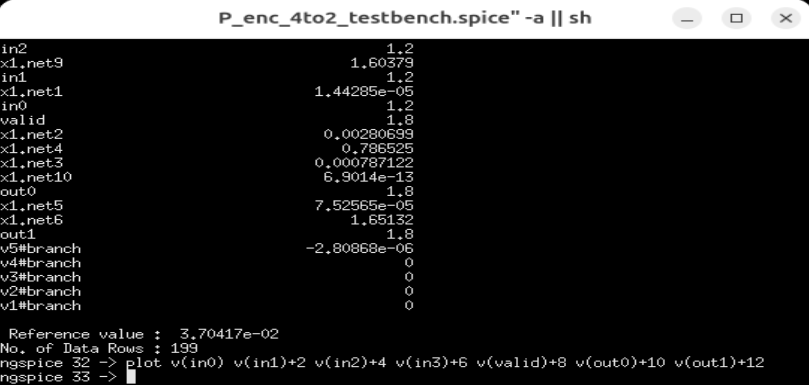

# 4-to-2 Priority Encoder (Transistor-Level)

This document describes the design and simulation of a **4-to-2 priority
encoder** implemented at the **transistor level** using the **Sky130 PDK**
in Xschem.
The priority encoder converts multiple inputs into a meaningful
binary representation based on priority and is a key digital block used in the **Flash ADC**
implemented in this repository.

---

## Functionality

A 4-to-2 priority encoder encodes the highest-priority asserted input
into a 2-bit binary output.

Priority order (highest to lowest):

| D3 | D2 | D1 | D0 | Y1 | Y0 | V |
|----|----|----|----|----|----|----|
| 0  | 0  | 0  | 0  | x  | x  | 0  |
| 0  | 0  | 0  | 1  | 0  | 0  | 1  |
| 0  | 0  | 1  | X  | 0  | 1  | 1  |
| 0  | 1  | X  | X  | 1  | 0  | 1  |
| 1  | X  | X  | X  | 1  | 1  | 1  |

---

## Design Approach

The priority encoder is implemented using **CMOS logic** based on the minimized boolean expressions:
 - valid = D0 + D1 + D2 + D3
 - out1 = D3 + D2
 - out0 = D3 + ((D1) & (~D2))

Priority is enforced by logically masking lower-priority inputs when a
higher-priority input is asserted.
This structured approach allows the encoder to be **easily scalable**
and suitable for cascading into higher-order encoders.

---

## Circuit Implementation

### Schematic  

  

The schematic implements Boolean logic equations derived from the priority
truth table. Each logic function is realized using CMOS transistor networks
to ensure reliable digital operation.

---

### Symbol

A dedicated symbol is created for hierarchical reuse, enabling clean
integration of the encoder into larger digital systems.

---

## Testbench Setup

### Testbench Schematic

The testbench applies:
- Mutually exclusive and overlapping input combinations
- Priority conflict scenarios
- Standard Sky130 supply voltage 1.8v

This ensures correct encoding behavior under all valid input conditions.

---

## Simulation 

### Waveform Results

Simulation results confirm:
- Correct binary encoding of the highest-priority active input
- Lower-priority inputs are ignored when higher-priority inputs are asserted
- Stable output transitions without glitches

---

### ngspice Simulation

ngspice is used to simulate and visualize the encoder operation. The plotted
signals include all inputs and encoded outputs, enabling direct correlation
between input priority and output code.

---

## Observations

- Correct priority resolution observed for all test cases
- Full rail-to-rail output swing
- Clean digital transitions suitable for downstream logic

---

## Conclusion

The 4-to-2 priority encoder functions correctly and serves as a critical
digital primitive for mixed-signal systems such as flash ADCs.
Its transistor-level implementation ensures compatibility with
Sky130-based designs.
